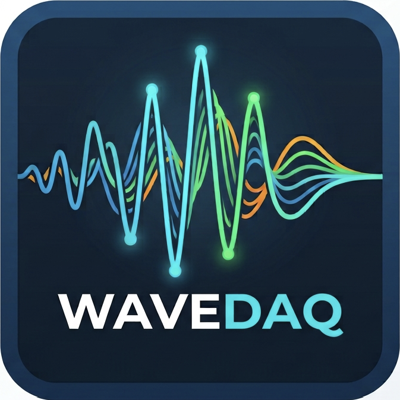
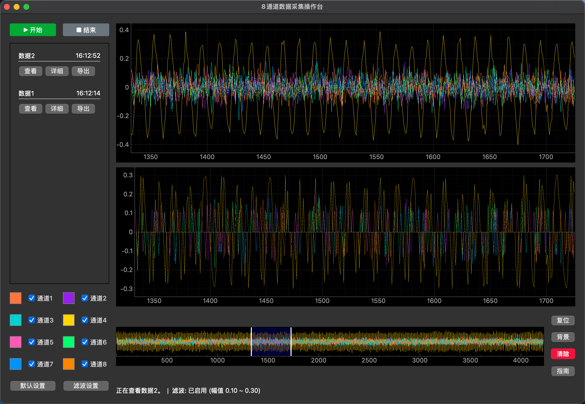

<p align="center">
  
</p>

<h1 align="center">WaveDAQ</h1>

<p align="center">
  8通道 UDP 实时数据采集与波形显示上位机
</p>

<p align="center">
  
  
  
  
</p>

---

## 界面预览



---

## 功能

- **实时采集**：通过 UDP（默认 8080 端口）接收 8 通道波形数据，实时绘图
- **记录管理**：最多保存 20 条采集记录，支持查看、重采、详细信息
- **阈值滤波**：可配置幅值上下限，滤波结果在独立窗口实时预览，不修改原始数据
- **惯性平移**：主图和滤波图支持左键拖动 + 惯性滑动，操作流畅自然
- **缩放联动**：主图、滤波图、overview 三图联动，overview 支持拖动快速定位
- **CSV 导出**：可选通道，支持导出原始数据或滤波结果，支持文件名模板（含日期/时间）
- **外观自定义**：每通道独立颜色，可修改背景色，通道显示开关

---

## 下载

前往 [Releases](https://github.com/LMDHQ-0420/WaveDAQ/releases/latest) 下载对应平台的安装包：

| 平台 | 文件 | 说明 |
|------|------|------|
| macOS | `WaveDAQ-mac-vX.X.X.dmg` | 打开 DMG，将 WaveDAQ.app 拖入 Applications。首次运行右键点击 → **打开** 绕过 Gatekeeper |
| Windows | `WaveDAQ-windows-vX.X.X.exe` | 双击直接运行，无需安装。杀毒软件如有拦截请选择"允许运行" |

---

## 从源码运行

**环境要求**：Python 3.11

```bash
# 克隆仓库
git clone git@github.com:LMDHQ-0420/WaveDAQ.git
cd WaveDAQ

# 安装依赖（推荐使用 conda 虚拟环境）
conda create -n WaveDAQ python=3.11 -y
conda activate WaveDAQ
pip install -r requirements.txt

# 启动
python run.py
```

---

## 数据格式

通过 UDP 8080 端口接收数据，帧格式如下：

```
| 帧头 4B     | 自定义头 8B | Payload         | 帧尾 4B     |
| 5A5A5A5A   | 00...00    | 8通道 × 128点    | 0D0A0D0A   |
```

- Payload 分前后两半，各包含 4 个通道 × 128 个采样点
- 每个采样点为 little-endian int16，归一化系数 3276.8
- 可用 `test_udp_sender.py` 模拟发送测试数据

---

## 项目结构

```
WaveDAQ/
├── run.py                        # 程序入口
├── requirements.txt
├── WaveDAQ.spec                  # PyInstaller 打包配置
├── test_udp_sender.py            # UDP 测试数据发送器
├── .github/workflows/build.yml   # 自动打包 CI
└── core/
    ├── acquisition/
    │   ├── data_manager.py       # 采集状态管理（预分配缓冲区）
    │   ├── frame_parser.py       # UDP 帧解析（向量化）
    │   └── udp_receiver.py       # UDP 接收线程
    ├── signal/
    │   ├── filters.py            # 阈值滤波（纯函数）
    │   └── downsampler.py        # 下采样（纯函数）
    ├── export/
    │   └── csv_exporter.py       # CSV 导出与文件命名
    └── ui/
        ├── main_window.py        # 主窗口（UI 构建 + 事件绑定）
        ├── plot_controller.py    # 绘图控制器（视口渲染 + 惯性）
        └── widgets.py            # 对话框组件
```

---

## 本地打包

```bash
# 安装打包工具
pip install pyinstaller

# Mac
pyinstaller WaveDAQ.spec
# 产物：dist/WaveDAQ.app

# Windows
pyinstaller WaveDAQ.spec
# 产物：dist/WaveDAQ.exe
```

---

## License

MIT
